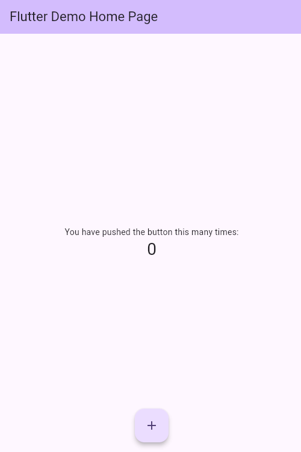
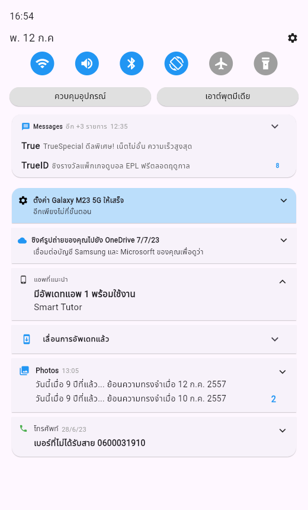
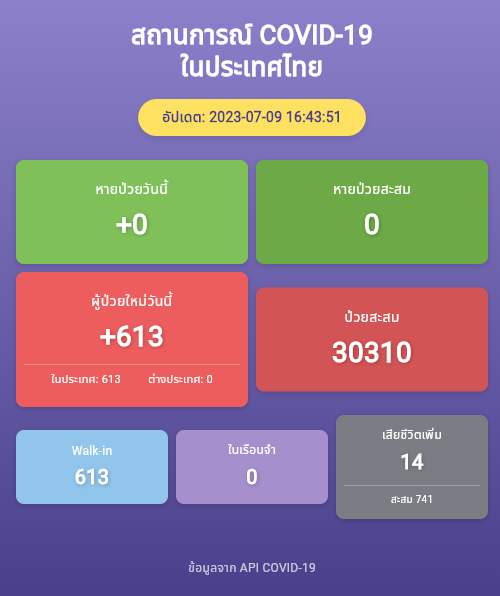
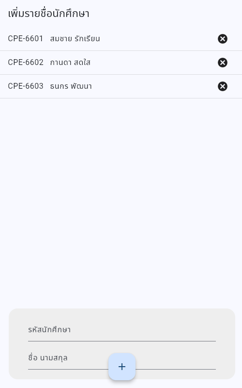
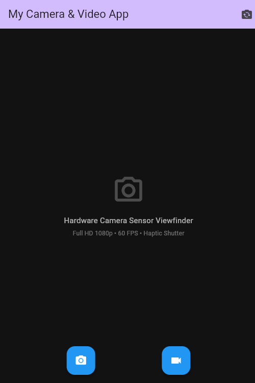
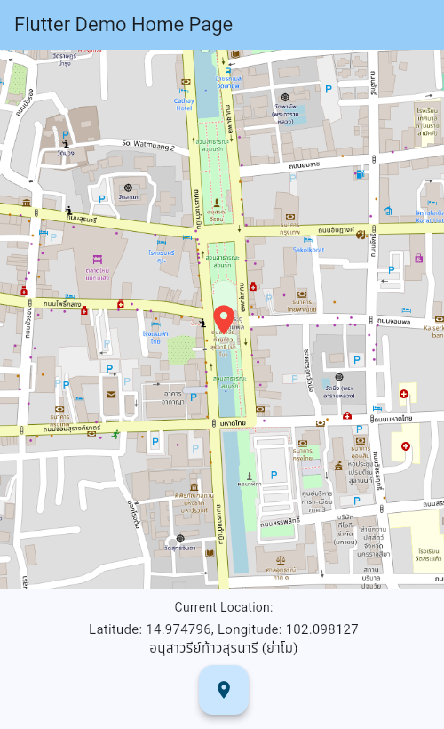

# Cross-Platform Mobile Application Development (Flutter & Dart)
### RMUTI Computer Engineering • Mobile Computing & Software Engineering Coursework

<div align="center">

[](https://flutter.dev)
[](https://dart.dev)
[](https://flutter.dev/multi-platform)
[](https://m3.material.io)
[](https://github.com/firstphethay11/flutter-mobile-coursework)

<p>
  คลังรวบรวมผลงานและโครงงานปฏิบัติการพัฒนาแอปพลิเคชันมือถือข้ามแพลตฟอร์มด้วย <strong>Flutter & Dart</strong><br />
  หลักสูตรวิศวกรรมคอมพิวเตอร์ มหาวิทยาลัยเทคโนโลยีราชมงคลอีสาน (RMUTI)
</p>

</div>

---

## สารบัญ (Table of Contents)

- [1. คลังภาพผลงานและตารางสรุปเชิงเทคนิค (Showcase & Technical Index)](#1-คลังภาพผลงานและตารางสรุปเชิงเทคนิค-showcase--technical-index)
- [2. รายละเอียดเชิงลึกแต่ละโมดูล (Technical Module Breakdown)](#2-รายละเอียดเชิงลึกแต่ละโมดูล-technical-module-breakdown)
  - [Lab 01: Flutter State & Counter Architecture](#lab-01-flutter-state--counter-architecture)
  - [Lab 05: Mobile OS Quick Settings & Notification Drawer](#lab-05-mobile-os-quick-settings--notification-drawer)
  - [Lab 06: COVID-19 Situation Dashboard & REST API](#lab-06-covid-19-situation-dashboard--rest-api)
  - [Lab 07: Student Roster Form, Dynamic List & Storage](#lab-07-student-roster-form-dynamic-list--storage)
  - [Lab 08: Hardware Camera Viewfinder, Video & Haptics](#lab-08-hardware-camera-viewfinder-video--haptics)
  - [Lab 09: GPS Geolocation & Map Routing](#lab-09-gps-geolocation--map-routing)
- [3. แผนผังโครงสร้างโฟลเดอร์ (Directory Structure)](#3-แผนผังโครงสร้างโฟลเดอร์-directory-structure)
- [4. ข้อมูลผู้จัดทำ (Author)](#4-ข้อมูลผู้จัดทำ-author)

---

## 1. คลังภาพผลงานและตารางสรุปเชิงเทคนิค (Showcase & Technical Index)

### ผลการรันจริงบนอุปกรณ์จำลอง (Mobile Viewport Showcase)

<table width="100%">
  <tr>
    <td width="50%" align="center" valign="top">
      <h4>Lab 01: Flutter State & Counter Architecture</h4>
      <div align="center">
        
      </div>
      <br />
      <p align="center"><em>การจัดการสถานะภายใน Widget Tree ด้วย setState() และ Material 3 Counter</em></p>
    </td>
    <td width="50%" align="center" valign="top">
      <h4>Lab 05: Mobile OS Quick Settings & Notification Drawer</h4>
      <div align="center">
        
      </div>
      <br />
      <p align="center"><em>แผงควบคุมระบบ Control Center และ Notification Feed สไตล์ Dark Theme</em></p>
    </td>
  </tr>
  <tr>
    <td width="50%" align="center" valign="top">
      <h4>Lab 06: COVID-19 Situation Dashboard & REST API</h4>
      <div align="center">
        
      </div>
      <br />
      <p align="center"><em>การเชื่อมต่อ Asynchronous REST API สู่ Typed Model และแสดงผล Metric Cards</em></p>
    </td>
    <td width="50%" align="center" valign="top">
      <h4>Lab 07: Student Roster Management & Dynamic List</h4>
      <div align="center">
        
      </div>
      <br />
      <p align="center"><em>ระบบลงทะเบียนรายชื่อนักศึกษาด้วย Dynamic ListView.builder และ Form Input</em></p>
    </td>
  </tr>
  <tr>
    <td width="50%" align="center" valign="top">
      <h4>Lab 08: Hardware Camera Viewfinder & Haptics</h4>
      <div align="center">
        
      </div>
      <br />
      <p align="center"><em>การควบคุมเซนเซอร์กล้องฮาร์ดแวร์ บันทึกภาพ/วิดีโอ สลับเลนส์ และระบบสั่น Haptic Feedback</em></p>
    </td>
    <td width="50%" align="center" valign="top">
      <h4>Lab 09: GPS Geolocation & Map Routing</h4>
      <div align="center">
        
      </div>
      <br />
      <p align="center"><em>การดึงพิกัดดาวเทียมเรียลไทม์ ปักหมุดแลนด์มาร์กย่าโม และระบบแผนที่นำทาง</em></p>
    </td>
  </tr>
</table>

### ตารางสรุปสถาปัตยกรรมและทักษะเชิงเทคนิค (Technical Competency Matrix)

<table width="100%">
  <thead>
    <tr>
      <th width="12%" align="center">โมดูล</th>
      <th width="32%" align="left">หัวข้อและทักษะทางวิศวกรรม</th>
      <th width="36%" align="left">สถาปัตยกรรม & ไลบรารีหลัก</th>
      <th width="20%" align="center">สถานะการทดสอบ</th>
    </tr>
  </thead>
  <tbody>
    <tr>
      <td align="center"><code>lab01</code></td>
      <td><strong>Flutter Counter & State</strong><br />วงจรชีวิต Stateful Widget และการอัปเดตสถานะด้วย <code>setState()</code></td>
      <td><code>flutter/material.dart</code>, Theme Seed Color, FloatingActionButton</td>
      <td align="center"></td>
    </tr>
    <tr>
      <td align="center"><code>lab05</code></td>
      <td><strong>Mobile OS Quick Settings</strong><br />จำลองแผงควบคุมระบบ (Control Center) และแถบแจ้งเตือนระดับ OS</td>
      <td>Custom Tile & Card Layouts, CircleAvatar Toggle State, Responsive Grid</td>
      <td align="center"></td>
    </tr>
    <tr>
      <td align="center"><code>lab06</code></td>
      <td><strong>COVID-19 Situation Dashboard</strong><br />การเชื่อมต่อ Public REST API แบบ Asynchronous แปลง JSON สู่ Data Model</td>
      <td><code>http: ^1.2.1</code>, JSON Deserialization, LinearGradient & Card Metrics</td>
      <td align="center"></td>
    </tr>
    <tr>
      <td align="center"><code>lab07</code></td>
      <td><strong>Student Roster Management</strong><br />ระบบจัดการรายชื่อด้วย Dynamic ListView, File Storage และ Form Handling</td>
      <td><code>path_provider: ^2.1.2</code>, <code>ListView.builder</code>, Keyboard FocusScope</td>
      <td align="center"></td>
    </tr>
    <tr>
      <td align="center"><code>lab08</code></td>
      <td><strong>Hardware Camera & Video</strong><br />การเข้าถึงเซนเซอร์ฮาร์ดแวร์ สลับเลนส์หน้า-หลัง บันทึกวิดีโอ และเซฟลงแกลเลอรี่</td>
      <td><code>camera: ^0.11.0+2</code>, <code>gallery_saver_plus</code>, <code>HapticFeedback</code></td>
      <td align="center"></td>
    </tr>
    <tr>
      <td align="center"><code>lab09</code></td>
      <td><strong>GPS Geolocation & Mapping</strong><br />ดึงพิกัดดาวเทียมเรียลไทม์ ตรวจสิทธิ์ Location ปักหมุดย่าโม และระบบแผนที่</td>
      <td><code>geolocator: ^14.0.3</code>, <code>google_maps_flutter</code>, <code>flutter_map</code></td>
      <td align="center"></td>
    </tr>
  </tbody>
</table>

---

## 2. รายละเอียดเชิงลึกแต่ละโมดูล (Technical Module Breakdown)

### Lab 01: Flutter State & Counter Architecture
- **โฟลเดอร์:** `labs/lab01-flutter-counter-state/`
- **แนวคิดหลัก:** เรียนรู้โครงสร้างรากฐานของ Flutter Framework แยกส่วนระหว่าง `StatelessWidget` และ `StatefulWidget`
- **การจัดการ State:** ใช้ `setState()` เพื่อกระตุ้นให้ Flutter Engine ทำการ Re-render เฉพาะกิ่งของ Widget Tree ที่มีการเปลี่ยนแปลงค่าตัวแปร `_counter`

### Lab 05: Mobile OS Quick Settings & Notification Drawer
- **โฟลเดอร์:** `labs/lab05-mobile-ui-quicksettings/`
- **แนวคิดหลัก:** การออกแบบ Responsive UI สำหรับแอปพลิเคชันมือถือที่มีความซับซ้อนสูง เลียนแบบแถบ Quick Settings และ Notification Tray ของสมาร์ตโฟน
- **คอมโพเนนต์สำคัญ:**
  - สวิตช์เปิด-ปิดการเชื่อมต่อ (Wi-Fi, Bluetooth, เสียง, หมุนหน้าจอ, โหมดเครื่องบิน, ไฟฉาย) ด้วย `CircleAvatar`
  - การ์ดแสดงผลการแจ้งเตือนหลายรูปแบบ (Messages, Phone, Google Cloud/OneDrive, App Updates)
  - การจัดการ ScrollView และ SafeArea เพื่อรองรับหน้าจอที่มีรอยบาก (Notch/Dynamic Island)

### Lab 06: COVID-19 Situation Dashboard & REST API
- **โฟลเดอร์:** `labs/lab06-covid-tracker-api/`
- **แนวคิดหลัก:** การสื่อสารข้อมูลผ่านเครือข่ายอินเทอร์เน็ตด้วยโปรโตคอล HTTP RESTful API
- **การจัดการข้อมูล:**
  - ดึงข้อมูลสถิติสดจาก API มหาวิทยาลัยเทคโนโลยีราชมงคลอีสาน (`https://rmuti.ac.th/user/wudthipong/`)
  - คลาส `CovidData` สำหรับ Deserialization ข้อมูล JSON Object เข้าสู่ตัวแปรประเภท Typed Data
  - ออกแบบแดชบอร์ดสรุปยอดผู้ป่วยรายวัน, ผู้ป่วยสะสม, ผู้รักษาหาย, และผู้เสียชีวิต ด้วยโทนสีสื่อความหมาย

### Lab 07: Student Roster Form, Dynamic List & Storage
- **โฟลเดอร์:** `labs/lab07-student-roster-form/`
- **แนวคิดหลัก:** การจัดการฟอร์มรับข้อมูล (Form Input Handling) และระบบบันทึกไฟล์ถาวร
- **แบ่งการพัฒนาเป็น 2 ส่วน:**
  - `part1-file-storage/`: การเข้าถึงไดเรกทอรีพื้นที่จัดเก็บของระบบผ่าน `path_provider` บันทึกรายชื่อลงไฟล์ข้อความ `students.txt`
  - `part2-dynamic-list-form/`: ส่วนติดต่อผู้ใช้ด้วย `ListView.builder` รองรับการเพิ่มและลบรายการแบบ Dynamic พร้อมกลไก `FocusScope.unfocus()` ซ่อนคีย์บอร์ดเมื่อกดเพิ่มข้อมูล

### Lab 08: Hardware Camera Viewfinder, Video & Haptics
- **โฟลเดอร์:** `labs/lab08-camera-video-recorder/`
- **แนวคิดหลัก:** การโต้ตอบกับฮาร์ดแวร์ระดับต่ำของอุปกรณ์มือถือ (Native Device Camera Subsystem)
- **คุณลักษณะสำคัญ:**
  - ตรวจสอบรายชื่อกล้องที่มีในระบบผ่าน `availableCameras()` และเปิดใช้ `CameraController`
  - สลับการทำงานระหว่างกล้องหน้าและกล้องหลัง (Camera Lens Facing Switch)
  - ถ่ายภาพนิ่ง (Photo Capture) และบันทึกวิดีโอ (Video Recording)
  - ระบบสั่นสัมผัส `HapticFeedback.vibrate()` เมื่อกดชัตเตอร์
  - นำไฟล์สื่อที่บันทึกได้ส่งเข้าสู่อัลบั้มของระบบปฏิบัติการมือถือผ่าน `GallerySaver`

### Lab 09: GPS Geolocation & Map Routing
- **โฟลเดอร์:** `labs/lab09-gps-google-maps/`
- **แนวคิดหลัก:** การระบุพิกัดตำแหน่งทางภูมิศาสตร์ (Location Services) และการประมวลผลแผนที่
- **คุณลักษณะสำคัญ:**
  - ตรวจสอบสิทธิ์การเข้าถึงตำแหน่ง `LocationPermission` และเปิดใช้งาน GPS เซนเซอร์ผ่าน `Geolocator`
  - คำนวณละติจูด/ลองจิจูดแบบ High Precision
  - ปักหมุดตำแหน่งปัจจุบัน และหมุดพิกัดปลายทาง **อนุสาวรีย์ท้าวสุรนารี (ย่าโม จ.นครราชสีมา)**: `14.974796 N, 102.098127 E`
  - ลากเส้นเชื่อมโยงเส้นทาง (Polyline) ระหว่างตำแหน่งผู้ใช้และปลายทาง

---

## 3. แผนผังโครงสร้างโฟลเดอร์ (Directory Structure)

```text
flutter-mobile-coursework/
├── labs/
│   ├── lab01-flutter-counter-state/           # พื้นฐาน Flutter Widget & Reactive State
│   │   ├── lib/main.dart
│   │   └── pubspec.yaml
│   │
│   ├── lab05-mobile-ui-quicksettings/         # จำลองแถบ Quick Settings & Notification Center
│   │   ├── lib/ (main.dart, Ep1.dart, Ep2.dart)
│   │   └── pubspec.yaml
│   │
│   ├── lab06-covid-tracker-api/               # COVID-19 Situation Dashboard & REST API
│   │   ├── lib/main.dart
│   │   └── pubspec.yaml
│   │
│   ├── lab07-student-roster-form/             # ระบบจัดการรายชื่อนักศึกษาและบันทึกไฟล์
│   │   ├── part1-file-storage/                # การอ่าน-เขียนไฟล์ข้อความในระบบ (path_provider)
│   │   └── part2-dynamic-list-form/           # ฟอร์มเพิ่ม-ลบรายชื่อ (Material 3 Dynamic List)
│   │
│   ├── lab08-camera-video-recorder/           # การเข้าถึงฮาร์ดแวร์กล้องและระบบสั่น
│   │   ├── lib/main.dart
│   │   └── pubspec.yaml
│   │
│   └── lab09-gps-google-maps/                 # พิกัด GPS และการเรนเดอร์แผนที่
│       ├── lib/ (main.dart, main_backup.dart)
│       ├── keyapi.example.txt
│       └── pubspec.yaml
│
├── docs/
│   └── screenshots/                           # ภาพถ่ายผลการรันจริง (Mobile Viewport)
│       ├── 01-lab01-counter-app.png
│       ├── 02-lab05-quicksettings-drawer.png
│       ├── 03-lab06-covid-dashboard.png
│       ├── 04-lab07-student-roster.png
│       ├── 05-lab08-camera-interface.png
│       └── 06-lab09-gps-map-routing.png
│
├── .gitignore                                 # กรอง Dart/Flutter artifacts และ API Keys
└── README.md                                  # เอกสารรวมระบบงานปฏิบัติการ
```

---

## 4. ข้อมูลผู้จัดทำ (Author)

<div align="center">

**Jirawat Thiamthanong**  
Computer Engineering Student, Rajamangala University of Technology Isan (RMUTI)  
Nakhon Ratchasima, Thailand

[GitHub](https://github.com/firstphethay11) &nbsp;•&nbsp; [LinkedIn](https://www.linkedin.com/in/phethay-genko-602261427/) &nbsp;•&nbsp; [Email](mailto:nongfirst.aoy@gmail.com)

</div>
